# 洞察 

洞察是宜信安全部用来对公司内部系统所出现的安全漏洞进行线上全生命周期管理的漏洞管理平台。

主要由3部分组成：
* 应用系统资产管理
* 漏洞生命周期管理
* 安全知识库管理

应用系统资产管理：对公司应用系统资产进行管理，包括系统名称、域名、重要级别、部门、负责人等。

漏洞生命周期管理：对公司应用系统产生的安全漏洞进行线上提交、通告、知悉、复测、分类、风险计算、修复期限计算、邮件提醒、漏洞数据分析统计等。

安全知识库管理：对安全知识、管理制度进行集中存放、线上学习、安全培训、知识传承等。

平台截图：

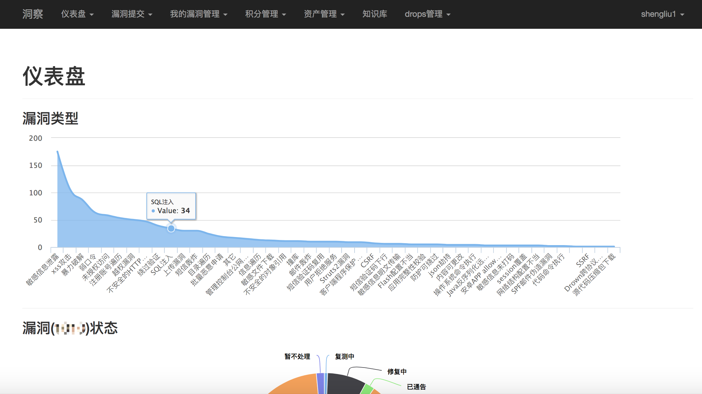

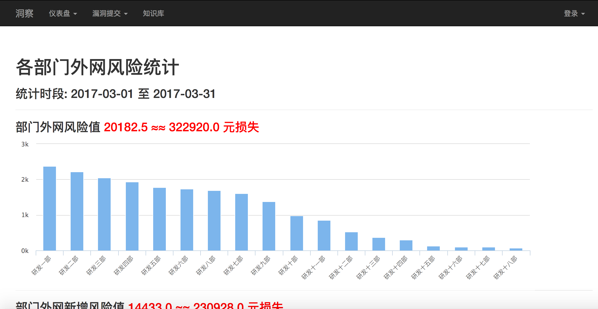

## 部署指南

目前只编写了docker部署指南，建议docker部署，详细请见：

[docker部署指南](docs/install.md)

## 使用指南

平台用户分为以下5种角色：
* 匿名用户：公司内部未登录用户
* 普通用户：普通登录用户，指公司研发、业务、产品经理等。
* 安全人员：安全部门进行漏洞测试、提交、跟踪修复的人员等。
* 安全管理员：安全部门对漏洞进行审核的管理人员。
* 超级管理员：最高权限账号，对用户的角色进行分配。

以上5种角色对应的使用文档请见：

[使用指南-匿名用户篇](docs/anonymous_user.md)

[使用指南-普通用户篇](docs/normal_user.md)

[使用指南-安全人员篇](docs/sec_user.md)

[使用指南-安全管理员篇](docs/sec_manager.md)

[使用指南-超级管理员篇](docs/super_user.md)

## 设计理念

应用安全管理从应用资产的风险评估开始，公司资产一旦多了之后，往往会面临资产不清晰、找不到负责人、漏洞持续跟踪成本高昂、安全知识难以沉淀、高频风险没有数据支持、不能有的放矢的解决核心问题，另外风险量化也是难题。

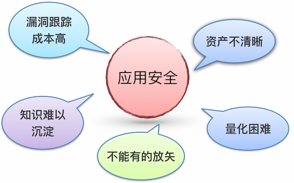

应用安全管理体系设计中，风险治理一般过程如下

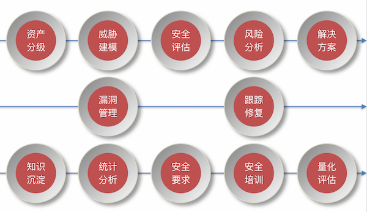

基于上述风险治理的实际需求，洞察应运而生。

## 平台亮点

使用洞察系统后，我们实现了以下目标，请看大图：

### 历史漏洞一目了然

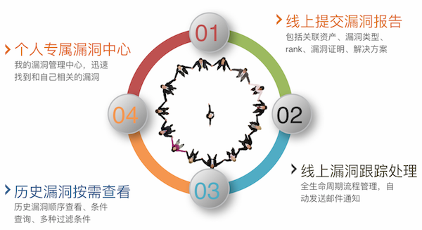

### 漏洞跟踪有条不紊

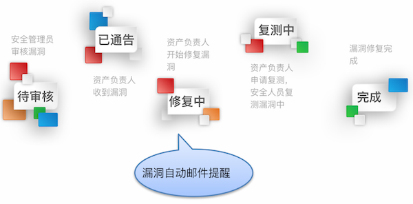

### 学习案例信手拈来

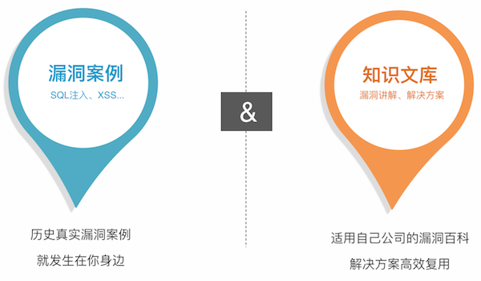

### 威胁风险有理有据

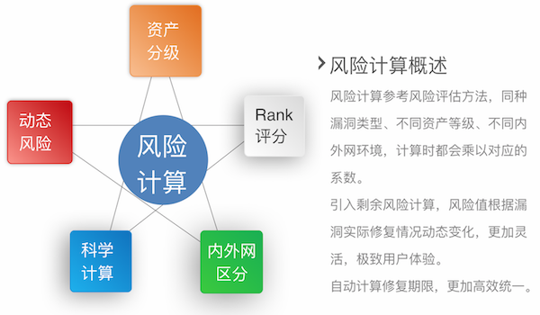

### 安全要求精准管控

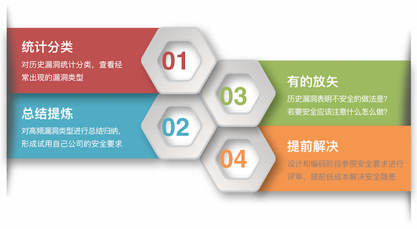

### 量化数字实时知晓

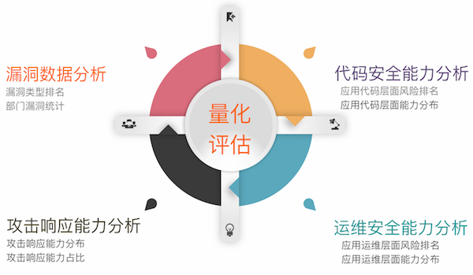

欢迎安全小伙伴使用、交流、fork、star、转发。

也欢迎安全小伙伴在使用洞察过程中和我们多多交流，扫描下方二维码，关注宜信安全应急响应中心公众号，回复“自己的微信号+洞察”，我们的运营小姐姐九色鹿会拉你进群讨论。

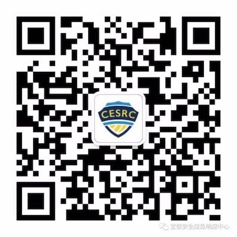